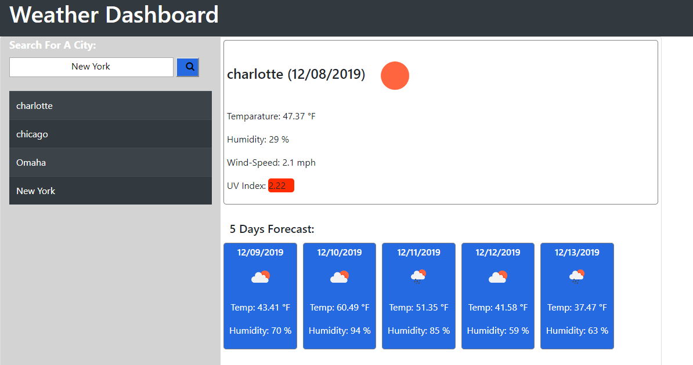
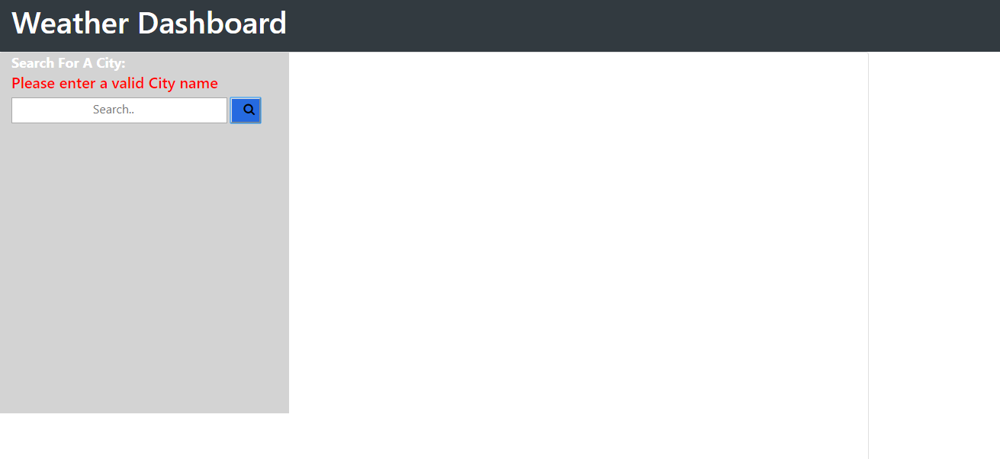

# 5-Days-Forecast_Weather_Dashboard

Title: Weather Dashboard
       

Usage/Description:
This assignment  is to allow user to search for any city and get the current weather.  

How does this work:
1- When user lands on the page, they will see a search field where they can enter a city within US. 

2- Once user clicks  on the search button they  get a page load with a current weather for the city they  have searched along with with fiv days weather forecast. 
3- For every city  entered it appends to the search history table on the side dynamically 
4- All searched cities should  save in the local storage.  
5- When user refreshes the page all the saved cities should dispaly and  the last search display it's weather contents.
6- Clicking on each history search should open the weather content of that specific city. 
 
Tool used to build this site.
1-	Html5 
2-	CSS3
3-  Bootstrap
3-	JavaScript 
4-  jQuery
5-  Moments.js

Credit:
I used the following sites for my  research  during this assignment:
1-google.com
2- https://www.w3schools.com/, stackoverflow.com, bootstrap.com, class recording.    
3-Classmates
4-TA’s and the instructor 

Deployed Link:
https://sile-kiman.github.io/5-Days-Forecast_Weather_Dashboard/

Test:
1 -Verify the pages  look and feel matche the wireframe provided for this assignment- (this maybe slightly different) 
2- Check the other specs such as when you click on each button the appropriate actions are performed. 
3-Verify all the pages that were supposed to display are there. 

Image of the Site:

 
License:
MIT License

Copyright (c) [2019] [Mamessile Kiman]

Permission is hereby granted, free of charge, to any person obtaining a copy
of this software and associated documentation files (the "Software"), to deal
in the Software without restriction, including without limitation the rights
to use, copy, modify, merge, publish, distribute, sublicense, and/or sell
copies of the Software, and to permit persons to whom the Software is
furnished to do so, subject to the following conditions:

The above copyright notice and this permission notice shall be included in all
copies or substantial portions of the Software.

THE SOFTWARE IS PROVIDED "AS IS", WITHOUT WARRANTY OF ANY KIND, EXPRESS OR
IMPLIED, INCLUDING BUT NOT LIMITED TO THE WARRANTIES OF MERCHANTABILITY,
FITNESS FOR A PARTICULAR PURPOSE AND NONINFRINGEMENT. IN NO EVENT SHALL THE
AUTHORS OR COPYRIGHT HOLDERS BE LIABLE FOR ANY CLAIM, DAMAGES OR OTHER
LIABILITY, WHETHER IN AN ACTION OF CONTRACT, TORT OR OTHERWISE, ARISING FROM,
OUT OF OR IN CONNECTION WITH THE SOFTWARE OR THE USE OR OTHER DEALINGS IN THE
SOFTWARE.

